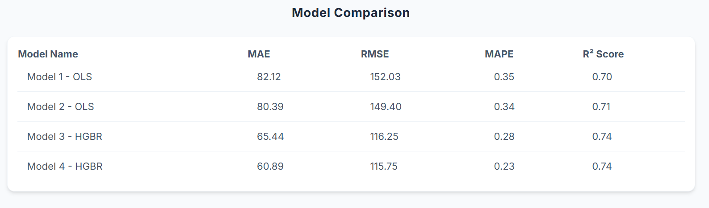

#  Seattle Airbnb Price Predictions 

An end-to-end machine learning project that analyzes Seattle Airbnb listings to predict nightly rental prices and uncover key factors driving property values.

##  Project Overview

* **Objective:** Predict Airbnb nightly listing prices using property features and location data.
* **Approach:** Compares traditional econometric modeling (`statsmodels` OLS) against modern tree-based machine learning models to evaluate performance and feature importance.
* **Key Deliverables:** A full modular Python pipeline (`main.py`) that outputs a comprehensive HTML summary report complete with visual graphs comparing the performance of each model and performance on the test set. 

##  Libraries & Tools Used

* **Language:** Python (3.11.4)
* **Data Manipulation & Analysis:** `pandas`, `numpy`
* **Statistical & Econometric Modeling:** `statsmodels` (for OLS regression analysis)
* **Machine Learning:** `scikit-learn` (for tree-based models and performance metrics)
* **Data Visualization & Reporting:** `matplotlib`, `seaborn`, generating custom HTML summary reports

##  Getting started

1. **Install dependencies:**
   ```bash
   pip install -r requirements.txt
   ```
2. **Add Data:**
   ``` bash
   Place your raw CSV files in the data/ directory.
   ```
3. **Execute the pipeline:**
   ```bash
   python main.py
   ```
##  Project Structure
``` text
air-bnb-price-predictions/
│
├── data/               # Raw and processed datasets
├── notebooks/          # Jupyter notebooks used for EDA and modeling
├── src/                # Python scripts for data cleaning/pipelines
├── outputs/            # Generated CSVs, graphs, statsmodels outputs, and an HTML summary 
├── README.md           # Project documentation
├── config.yaml         # Configuration settings 
├── assets/             # Saved example files for Github
└── requirements.txt    # Python dependencies
```
##  Configuration

The project uses a configuration file (`config.yaml`) to manage settings such as data paths, feature selection, model hyperparameters, and output directories. You can modify these values to adjust pipeline behavior without editing the core Python code.

Example `config.yaml`:
```yaml
hyperparameters:
  categorical_features: from_dtype
  random_state: 42
  l2_regularization: 5.0
features:
  numeric: &base_num
    - "accommodates"
    - "minimum_nights"
    - "bathrooms"
```
##  Pipeline & Architecture

This project is built using **Python and Pandas**, structured as a modular command-line application.

### Workflow Overview

1. **Ingestion (`main.py`):** The console-driven script loads the raw CSV files locally.
2. **Train/Test Split (Data Leakage Prevention):** The dataset is split into training and testing sets before any modeling or processing occurs (using a hash on the listing ID to ensure deterministic, clean separation), guaranteeing valid evaluation
3. **Data Cleaning & Preprocessing:** Dedicated submodules handle feature engineering, dropping unneeded columns, formatting messy data fields, and standardizing dates. Prices that are extreme outliers or likely to be mistakes are dropped. 
4. **Statistical Modeling (`statsmodels`):** The pipeline fits two Ordinary Least Squares (OLS) models to evaluate baseline relationships and coefficients.
5. **Machine Learning (`scikit-learn`):** The pipeline then fits two HistGradientBoostingRegressor (HGBR) models to capture non-linear patterns.
6. **Automated Reporting:** Results, performance metrics, and model summaries are compiled and automatically outputted as CSVs, graphs, and a clean HTML summary report post-evaluation.

##  Exploratory Data Analysis (EDA)

While the core application runs via the modular `main.py` pipeline, a companion Jupyter notebook (`air_bnb_seattle_eda_and_modeling.ipynb`) is included in the repository. This notebook contains the exploratory data visualizations, distribution plots, and correlation checks used to guide feature selection—all performed strictly on the training set to prevent data leakage. It also contains the four data models. 

##  Results & Discussion

This project evaluates four distinct models, progressing from interpretable econometric baselines to advanced gradient-boosted non-linear models. Nightly prices ranged from $10 to around $3300 a night:

* **1. Standard OLS Model (Baseline):** 
  * Built using `statsmodels` to establish initial feature coefficients and statistical significance.
  * Target values were log-transformed due to the large right skew in nightly prices. 
  * When considering the 10 features with the highest t-values, the "shared room" feature was the most important predictor.
  * Limitation: Assumed linearity, which failed to capture diminishing returns or non-linear jumps in pricing for features like minimum number of nights. 

* **2. Binned-Feature OLS Model:** 
  * Refined the econometric approach by binning non-linear features (such as `accommodates`,`bathrooms`, and `minimum nights` ) to better account for real-world pricing structures.
  * Target values were log-transformed due to the large right skew in nightly prices.
  * When considering the 10 features with the highest t-values, the "shared room" feature was the most important predictor. 
  * Improved overall interpretability and baseline fit slightly compared to the unbinned linear model.

* **3. Standard HistGradientBoosting Regressor (HGBR):** 
  * Implemented using `scikit-learn` to capture complex, non-linear interactions and feature dependencies.
  * Based on permutation feature importance, "month" (month the listing was last scraped) was the most important predictor, yielding the highest mean drop in $R^2$. 
  * Outperformed the OLS baselines by handling feature interactions automatically.

* **4. Gamma Loss HistGradientBoosting Regressor (Final Model):** 
  * Addressed the strongly right-skewed distribution of Airbnb prices by switching the loss function from standard squared error to Gamma loss.
  * Based on permutation feature importance, "month" (month the listing was last scraped) was the most important predictor, yielding the highest mean drop in $R^2$. 
  * Provided the most robust predictions, preventing high-end luxury outliers from distorting model performance across typical listings.

## Output Summary
All comprehensive evaluation metrics (such as RMSE, MAE, MAPE, and $R^2$) and visual diagnostic plots are automatically compiled and saved into the project's HTML summary report (`output/`). Part of the HTML summary that compares the four models is below.



[View the full HTML results report](.\outputs\run_20260930_115412\model_performance_report.html)

##  Limitations and Future Implications 

### Limitations
* The project only used a limited amount of data from one city (Seattle) and two of the available data sets were missing nightly prices. 
* The large range of prices with a heavy right skew likely reduces the accuracy of the model. This is most apparent when the nightly price starts to exceed $1000 a night. 
* This model uses neighborhood groups as a location categorical feature partially due to the limited number of observations. Zip codes could be used as the location feature with more observations. 

### Future Implications & Work
* **Model Expansion:** A better pipeline for dealing with the large range of prices and right skew could first categorize listings as luxury or standard before being fed into one of two HGBR models. 
* **Spatial Analysis:** Currently utilizes neighborhood groups for robust modeling; infrastructure exists to expand into precise polygon-based zip code sorting via `.shp` files if higher granularity is required.
* **Geospatial Feature Engineering:** Incorporating more granular spatial data (like distance to transit hubs or specific neighborhood boundaries) to further refine the regression performance.
* **Unstructured Text Analysis (NLP):** Expanding the pipeline to process listing descriptions and text fields using Natural Language Processing (NLP) techniques to evaluate how specific keywords or descriptive sentiment correlate with listing prices.


## Data Attribution & License

### Data Source
* **Provider:** [Inside Airbnb](http://insideairbnb.com/)
* **Dataset:** Seattle listings data, utilized in accordance with Inside Airbnb's non-commercial data and community guidelines. This project uses the 15 June, 2026 and 25 September, 2025 detailed listings data sets. 
* **Note:** Per their data policy, raw data files are not hosted directly in this repository; data should be downloaded directly from their platform
* **Context:** Inside Airbnb is an independent, non-commercial public advocacy project that compiles and analyzes public data from the platform. 

### License
This project's code is distributed under the **MIT License**. 
*(Note: Data obtained from Inside Airbnb is utilized in accordance with their non-commercial public data use and attribution guidelines).*